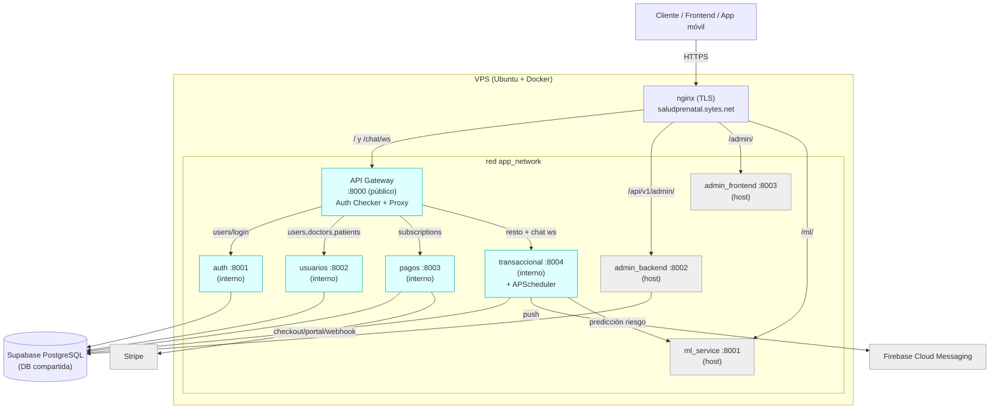
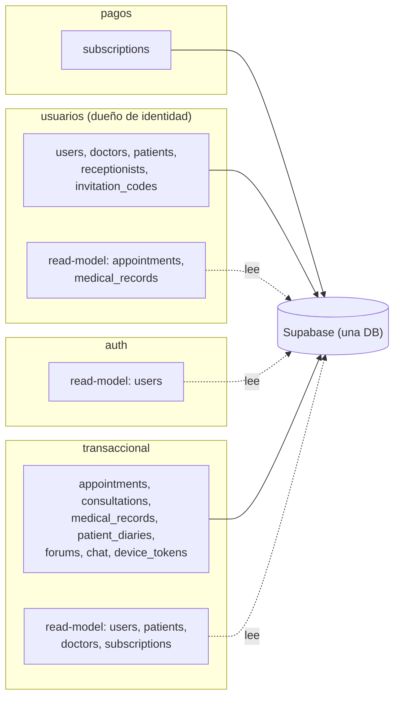
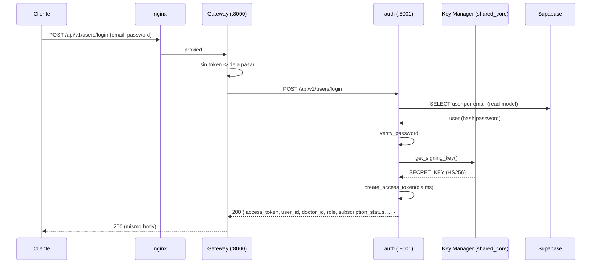
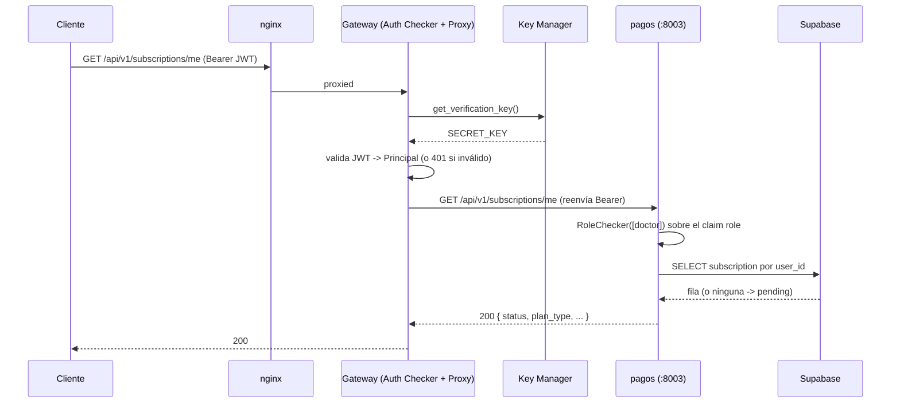
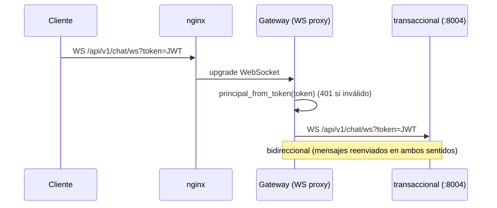
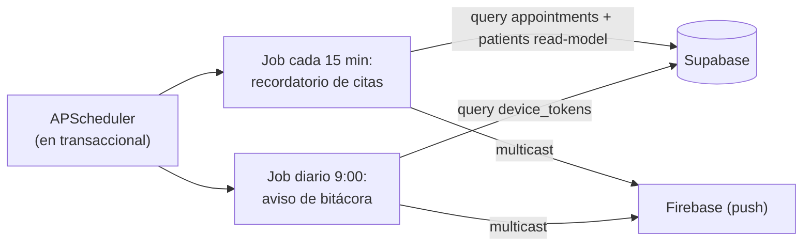

# Arquitectura — Salud Prenatal (microservicios / vertical slicing)

> Documento de referencia para diagramación. Describe componentes, despliegue,
> ownership de datos y flujos de la plataforma tras dividir el monolito FastAPI en
> 4 servicios + un API Gateway, sobre una base de datos PostgreSQL compartida
> (Supabase). Cada sección incluye lo necesario para dibujar un diagrama (componentes,
> relaciones, direcciones, puertos).

---

## 1. Resumen ejecutivo

- **Estilo:** vertical slicing desplegado como servicios independientes sobre **una DB compartida** (no microservicios con DB por servicio).
- **Entrada única:** un **API Gateway** (Python/FastAPI) que valida el JWT y hace de proxy hacia los servicios internos. El frontend solo conoce el gateway.
- **4 servicios de dominio:** `auth`, `usuarios`, `pagos`, `transaccional`.
- **Librería común:** `shared_core` (no es un servicio; es un paquete Python instalado en los 5).
- **DB:** PostgreSQL en Supabase, compartida por los 4 servicios de dominio.
- **Externos:** Stripe (pagos), Firebase Cloud Messaging (notificaciones en transaccional), servicio de ML (predicción de preeclampsia, consumido por transaccional).

---

## 2. Componentes

### 2.1 API Gateway (entrada pública)
- **Tipo:** aplicación FastAPI (Python).
- **Puerto:** `8000` (único expuesto al host / detrás de nginx).
- **Rol doble:**
  - **Auth Checker:** si el request trae `Authorization: Bearer <jwt>`, valida el token localmente contra la `SECRET_KEY` (vía el Key Manager de `shared_core`). Si el token es inválido → `401`. Si NO trae token, deja pasar (la autorización fina la decide cada servicio).
  - **Proxy:** enruta por prefijo de path al servicio interno correspondiente y reenvía la respuesta.
- **Extras:** proxy de WebSocket para el chat; Swagger agregado (selector de specs de los 4 servicios).
- **No tiene base de datos.**

### 2.2 Servicio `auth` — "Auth Generator"
- **Puerto interno:** `8001` (no expuesto al host).
- **Rol:** login. Verifica credenciales y **emite** el JWT (único servicio que firma tokens).
- **Datos:** NO es dueño de tablas; **lee** la tabla `users` (read-model) para verificar password.
- **Endpoint:** `POST /api/v1/users/login`.

### 2.3 Servicio `usuarios`
- **Puerto interno:** `8002`.
- **Rol:** CRUD de usuarios, doctores, pacientes, recepcionistas, códigos de invitación; dashboards.
- **Tablas propias (owner):** `users`, `doctors`, `patients`, `receptionists`, `invitation_codes`.
- **Read-models (lee de otros):** `appointments`, `medical_records` (para armar dashboards).
- **Endpoints:** `/api/v1/users/**`, `/api/v1/doctors/**`, `/api/v1/patients/**`.

### 2.4 Servicio `pagos`
- **Puerto interno:** `8003`.
- **Rol:** suscripciones y facturación con Stripe.
- **Tablas propias (owner):** `subscriptions`.
- **Externo:** Stripe (checkout, portal, webhooks).
- **Endpoints:** `/api/v1/subscriptions/{checkout-session, portal-session, me, webhook}`.

### 2.5 Servicio `transaccional` (el más grande)
- **Puerto interno:** `8004`.
- **Rol:** 7 features — `appointments`, `consultations`, `medical_record`, `patient_diaries`, `forums`, `chat`, `notifications`.
- **Tablas propias (owner):** `appointments`, `consultations`, `medical_records`, `risk_predictions`, `patient_diaries`, `diary_body_zones`, `diary_symptom_extractions`, `posts`, `comments`, `community_groups`, `reports`, `social_profiles`, `device_tokens`.
- **Read-models (lee de otros):** `users`, `patients`, `doctors`, `receptionists` (de usuarios), `subscriptions` (de pagos).
- **Procesos en segundo plano (APScheduler):** recordatorio de citas (cada 15 min), aviso diario de bitácora (9:00). Envían push vía Firebase.
- **Externo:** servicio de ML (predicción de riesgo) vía HTTP; Firebase (push).
- **Endpoints:** `/api/v1/{appointments, consultations, medical_record, patient_diaries, profiles, groups, posts, reports, notifications}/**`, `/api/v1/chat/**` (incl. WebSocket).

### 2.6 `shared_core` (librería común, NO servicio)
Paquete Python instalado en los 5 componentes. Contiene:
- `Base` y `ReadModelBase` (declarative bases de SQLAlchemy) + `TimestampMixin`.
- Conexión a DB (`get_engine`, `get_session_factory`, `get_db`) con `pool_pre_ping` + `pool_recycle`.
- **Seguridad JWT:** `create_access_token`, `verify_password`, `EncryptedString` (cifrado de PII con Fernet).
- **Key Manager:** `IJwtKeyProvider` (port) + `EnvJwtKeyProvider` (HS256/env hoy; preparado para JWKS/servicio externo).
- **Auth por claims:** `Principal`, `get_current_user`, `get_current_user_optional`, `require_active_subscription`, `RoleChecker`.
- Enums, utilidades de tiempo/texto, manejo de errores.

### 2.7 Componentes coexistentes (NO parte del split)
Corren en el mismo VPS/red pero son aplicaciones aparte:
- **`ml_service`** (`machine_learning_service`) — puerto host `8001`. Predicción de preeclampsia. Consumido por `transaccional`.
- **`admin_backend`** (`salud_prenatal_administrador_backend`) — puerto host `8002`. API de administración (login propio, gestión de usuarios/reportes).
- **`admin_frontend`** (`admin_salud_prenatal`) — puerto host `8003`. Frontend del panel admin.

---

## 3. Topología de despliegue (VPS)

- **Host:** Ubuntu 24.04, Docker + Docker Compose.
- **Reverse proxy:** nginx con TLS (Let's Encrypt) sobre `saludprenatal.sytes.net`.
- **DB:** Supabase (PostgreSQL gestionado, vía connection pooler). No hay Postgres local.
- **Orquestación:** un `docker-compose.yml` con 8 servicios en la red bridge `app_network`.

### 3.1 Enrutamiento nginx (dominio → contenedor)

| Ruta pública (HTTPS) | Destino | Componente |
|---|---|---|
| `/api/v1/admin/` | `:8002` | admin_backend |
| `/admin/` | `:8003` | admin_frontend |
| `/ml/` | `:8001` | ml_service |
| `/api/v1/chat/ws` (WebSocket) | `:8000` | **gateway** (proxya a transaccional) |
| `/` (todo lo demás) | `:8000` | **gateway** |

> El gateway es un reemplazo *drop-in* del antiguo monolito en `:8000`: como conserva
> los mismos paths `/api/v1/...` (paridad de rutas), nginx no cambió.

### 3.2 Puertos: host vs interno (importante para el diagrama)

| Servicio | Puerto interno (contenedor) | ¿Publicado al host? |
|---|---|---|
| gateway | 8000 | **Sí** → 8000 |
| auth | 8001 | No (solo `app_network`) |
| usuarios | 8002 | No |
| pagos | 8003 | No |
| transaccional | 8004 | No |
| ml_service | 8001 | **Sí** → 8001 |
| admin_backend | 8002 | **Sí** → 8002 |
| admin_frontend | 80 | **Sí** → 8003 |

> Los servicios internos usan 8001–8004 **dentro** de sus contenedores; no colisionan
> con ml/admin porque no publican esos puertos al host. El gateway los alcanza por
> **nombre de servicio** en `app_network` (`http://auth:8001`, `http://usuarios:8002`,
> `http://pagos:8003`, `http://transaccional:8004`).

### 3.3 Diagrama de componentes / despliegue (Mermaid)



---

## 4. Seguridad y autenticación

### 4.1 Piezas
- **Auth Generator** = servicio `auth`: firma el JWT en el login.
- **Key Manager** = `IJwtKeyProvider` en `shared_core`: provee la llave. Hoy `EnvJwtKeyProvider` (HS256, misma `SECRET_KEY` para firmar y validar). Preparado para cambiar a un servicio externo (RS256/JWKS) sin tocar firma ni validación.
- **Auth Checker** = el gateway (y cada servicio) validan el token con la llave del Key Manager, **sin consultar la base de datos**.
- **Principal:** identidad reconstruida desde los claims del JWT: `user_id`, `email` (`sub`), `role`, `subscription_status`.

### 4.2 Claims del JWT
```
sub                 = email del usuario
user_id             = id del usuario
role                = admin | paciente | doctor | recepcionista
subscription_status = active | pending | past_due | canceled | null
exp                 = expiración (30 min)
```

### 4.3 Autorización
- `RoleChecker([roles])`: gatea por el claim `role`.
- `require_active_subscription`: exige `subscription_status == active` a los doctores (lee el claim, no la DB).
- `ad_eligibility` (foros): excepción que sí lee la tabla `subscriptions`, porque necesita `plan_type` (no viaja en el token).

---

## 5. Ownership de datos y read-models

**Regla:** el *schema* de la DB es el contrato. Cada tabla tiene UN servicio dueño (la crea y escribe). Otro servicio que necesite leerla define un **read-model** (mapea solo las columnas necesarias, sobre `ReadModelBase`, que **nunca** se pasa a `create_all` — así un no-dueño jamás crea una versión parcial de una tabla ajena).

| Tabla | Dueño (escribe) | Lectores por read-model |
|---|---|---|
| `users` | usuarios | auth, transaccional |
| `doctors`, `patients`, `receptionists`, `invitation_codes` | usuarios | transaccional |
| `subscriptions` | pagos | transaccional |
| `appointments`, `medical_records` | transaccional | usuarios |
| resto de tablas transaccionales | transaccional | — |

### 5.1 Diagrama de ownership (Mermaid)



---

## 6. Flujo: LOGIN (secuencia)



---

## 7. Flujo: REQUEST AUTENTICADO (secuencia)

Ejemplo: `GET /api/v1/subscriptions/me` con `Authorization: Bearer <jwt>`.



---

## 8. Flujo: WebSocket de chat



---

## 9. Flujo: jobs en segundo plano (transaccional)



---

## 10. Ruteo del gateway (tabla para el diagrama de decisión)

El gateway elige el servicio destino por el path (case-insensitive):

| Contiene en el path | Servicio destino |
|---|---|
| `users/login` | auth |
| `users`, `doctors`, `patients`, `receptionists` | usuarios |
| `subscriptions` | pagos |
| cualquier otro | transaccional |

Reglas de auth del gateway:
- Trae `Bearer` válido → continúa. `Bearer` inválido → `401`.
- Sin `Authorization` → **deja pasar** (cada servicio decide si esa ruta requiere auth).

---

## 11. Dependencias externas (para el diagrama de contexto)

| Externo | Lo usa | Para qué |
|---|---|---|
| Supabase PostgreSQL | auth, usuarios, pagos, transaccional | base de datos compartida |
| Stripe | pagos | checkout, portal de facturación, webhooks |
| Firebase Cloud Messaging | transaccional | notificaciones push |
| ML service (interno, `:8001`) | transaccional | predicción de riesgo de preeclampsia |

---

## 12. Notas para quien diagrame

- Distinguir visualmente **los 4 servicios del split + gateway** (mío) de **ml/admin** (coexisten, no son parte del split).
- El **gateway es el único punto de entrada** para el frontend; los 4 servicios internos NO son accesibles directo desde afuera.
- **Una sola base de datos** (Supabase) compartida — NO dibujar una DB por servicio.
- Las flechas **sólidas** = escribe/es dueño; **punteadas** = lee por read-model.
- `shared_core` es una **librería** (dependencia compilada dentro de cada servicio), no un contenedor en la red — represéntala como componente compartido/estereotipo «library», no como nodo de despliegue.
