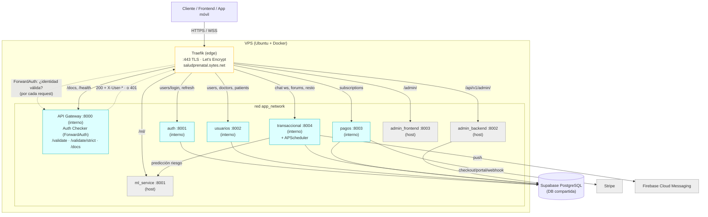
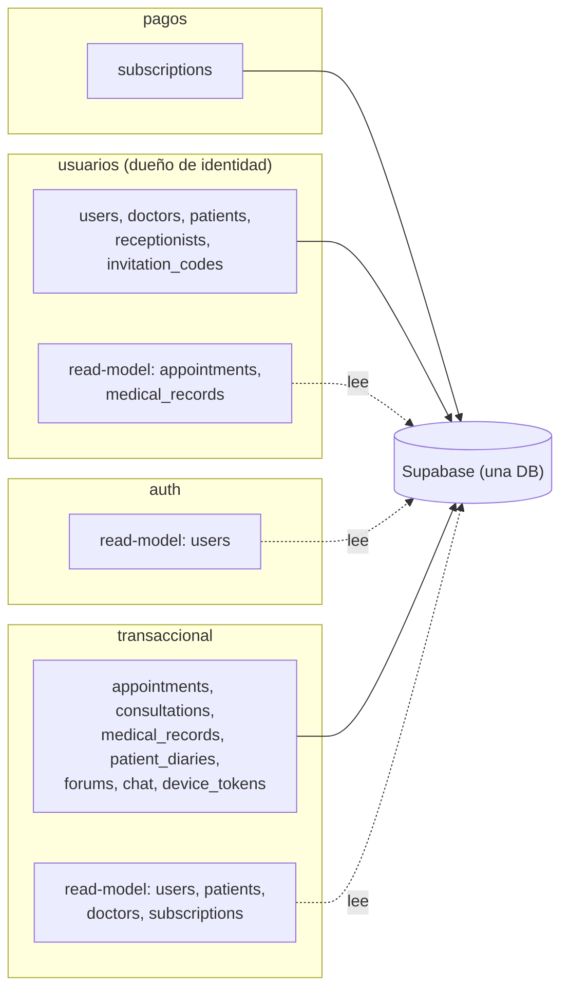
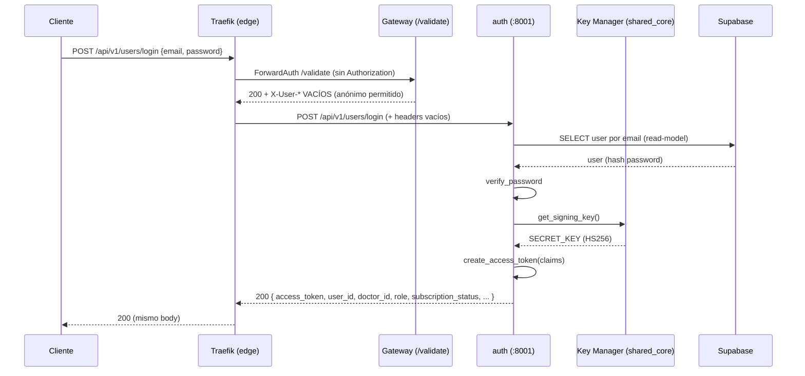
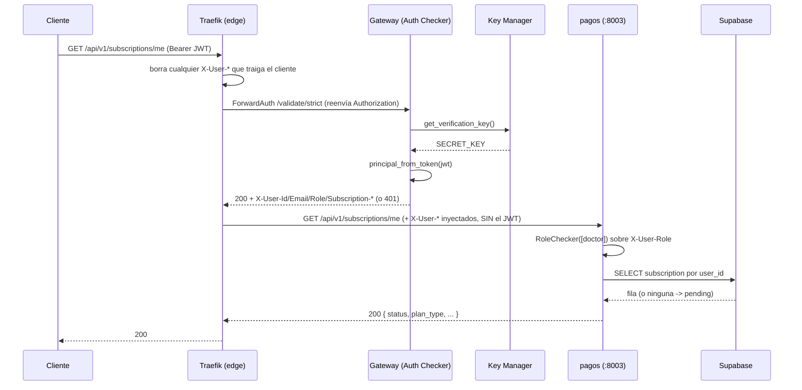
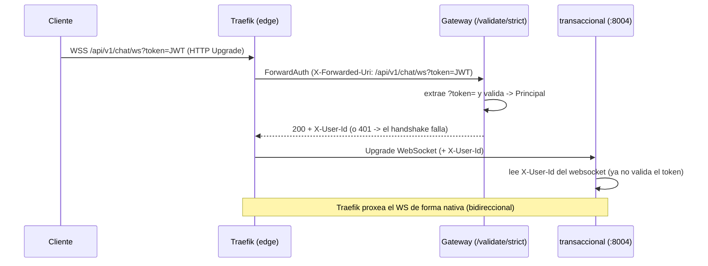
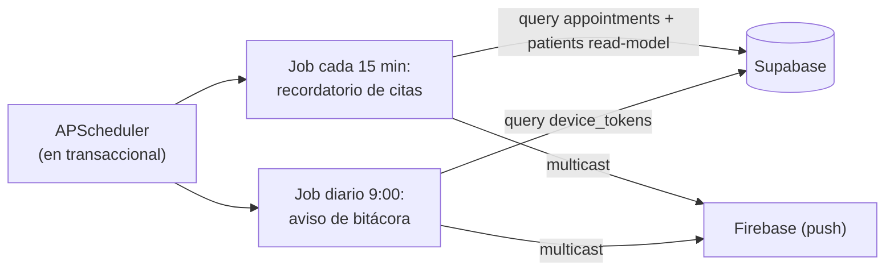

# Arquitectura — Salud Prenatal (microservicios / vertical slicing)

> Documento de referencia para diagramación. Describe componentes, despliegue,
> ownership de datos y flujos de la plataforma tras dividir el monolito FastAPI en
> 4 servicios + un API Gateway, sobre una base de datos PostgreSQL compartida
> (Supabase). Cada sección incluye lo necesario para dibujar un diagrama (componentes,
> relaciones, direcciones, puertos).

---

## 1. Resumen ejecutivo

- **Estilo:** vertical slicing desplegado como servicios independientes sobre **una DB compartida** (no microservicios con DB por servicio).
- **Entrada única:** **Traefik** como reverse proxy / edge (TLS + enrutamiento por labels), y detrás un **API Gateway** (FastAPI) que actúa como backend de **ForwardAuth**: valida el JWT **una sola vez** y le inyecta la identidad a los servicios. El frontend solo conoce el dominio.
- **4 servicios de dominio:** `auth`, `usuarios`, `pagos`, `transaccional`. **Ninguno decodifica JWT**: leen los headers `X-User-*` que inyecta el edge.
- **Librería común:** `shared_core` (no es un servicio; es un paquete Python instalado en los 5).
- **DB:** PostgreSQL en Supabase, compartida por los 4 servicios de dominio.
- **Externos:** Stripe (pagos), Firebase Cloud Messaging (notificaciones en transaccional), servicio de ML (predicción de preeclampsia, consumido por transaccional).

---

## 2. Componentes

### 2.1 Traefik (edge / entrada pública)
- **Tipo:** reverse proxy (imagen `traefik:v3.7`), configurado por **labels de Docker** (auto-descubrimiento; no hay archivo de rutas).
  > La versión **no es negociable hacia abajo**: el VPS corre Docker Engine 29 (API mínima 1.40)
  > y Traefik ≤3.5 pide la API 1.24 → el provider de Docker falla, no descubre ningún
  > contenedor y **todo responde 404**. `DOCKER_API_VERSION` no lo arregla (3.5 la ignora).
  > Verificado en el VPS: 3.5.6 falla, 3.7.8 funciona.
- **Puertos:** `443` (HTTPS) y `80` (redirect a HTTPS) en el VPS; `8000` en local.
- **Rol:**
  - **TLS:** certificados Let's Encrypt automáticos (challenge HTTP-01).
  - **Enrutamiento:** elige el servicio destino por regla de path (ver §10).
  - **ForwardAuth:** antes de enrutar consulta al API Gateway si el request trae identidad válida.
  - **WebSocket:** proxea el upgrade del chat de forma nativa.

### 2.2 API Gateway — "Auth Checker" (backend de ForwardAuth)
- **Tipo:** aplicación FastAPI (Python). Estructura en **vertical slices** (`features/jwt_validation`, `features/docs_aggregation`) con Ports & Adapters.
- **Puerto:** `8000` **interno** (no se publica: solo lo llama Traefik dentro de la red).
- **Rol:** es el **único componente que decodifica JWTs** en todo el sistema.
  - `GET /validate` — *valida-si-viene*: sin token responde `200` con identidad vacía; token inválido → `401`.
  - `GET /validate/strict` — *fail-closed*: anónimo → `401`.
  - En ambos casos, si el token es válido responde `200` con los headers `X-User-*` (§4.2), que Traefik copia al request.
  - Acepta el token por `Authorization: Bearer` o por `?token=` (leído de `X-Forwarded-Uri`, la vía del WebSocket).
- **Extras:** Swagger agregado (`/docs`, selector de specs de los 4 servicios).
- **NO proxea tráfico** (eso lo hace Traefik) y **no tiene base de datos**.

### 2.3 Servicio `auth` — "Auth Generator"
- **Puerto interno:** `8001` (no expuesto al host).
- **Rol:** login. Verifica credenciales y **emite** el JWT (único servicio que firma tokens).
- **Datos:** NO es dueño de tablas; **lee** la tabla `users` (read-model) para verificar password.
- **Endpoints:** `POST /api/v1/users/login` (público), `POST /api/v1/users/refresh` (exige identidad).

### 2.4 Servicio `usuarios`
- **Puerto interno:** `8002`.
- **Rol:** CRUD de usuarios, doctores, pacientes, recepcionistas, códigos de invitación; dashboards.
- **Tablas propias (owner):** `users`, `doctors`, `patients`, `receptionists`, `invitation_codes`.
- **Read-models (lee de otros):** `appointments`, `medical_records` (para armar dashboards).
- **Endpoints:** `/api/v1/users/**`, `/api/v1/doctors/**`, `/api/v1/patients/**`.

### 2.5 Servicio `pagos`
- **Puerto interno:** `8003`.
- **Rol:** suscripciones y facturación con Stripe.
- **Tablas propias (owner):** `subscriptions`.
- **Externo:** Stripe (checkout, portal, webhooks).
- **Endpoints:** `/api/v1/subscriptions/{checkout-session, portal-session, me, webhook}`.

### 2.6 Servicio `transaccional` (el más grande)
- **Puerto interno:** `8004`.
- **Rol:** 7 features — `appointments`, `consultations`, `medical_record`, `patient_diaries`, `forums`, `chat`, `notifications`.
- **Tablas propias (owner):** `appointments`, `consultations`, `medical_records`, `risk_predictions`, `patient_diaries`, `diary_body_zones`, `diary_symptom_extractions`, `posts`, `comments`, `community_groups`, `reports`, `social_profiles`, `device_tokens`.
- **Read-models (lee de otros):** `users`, `patients`, `doctors`, `receptionists` (de usuarios), `subscriptions` (de pagos).
- **Procesos en segundo plano (APScheduler):** recordatorio de citas (cada 15 min), aviso diario de bitácora (9:00). Envían push vía Firebase.
- **Externo:** servicio de ML (predicción de riesgo) vía HTTP; Firebase (push).
- **Endpoints:** `/api/v1/{appointments, consultations, medical_record, patient_diaries, profiles, groups, posts, reports, notifications}/**`, `/api/v1/chat/**` (incl. WebSocket).

### 2.7 `shared_core` (librería común, NO servicio)
Paquete Python instalado en los 5 componentes. Contiene:
- `Base` y `ReadModelBase` (declarative bases de SQLAlchemy) + `TimestampMixin`.
- Conexión a DB (`get_engine`, `get_session_factory`, `get_db`) con `pool_pre_ping` + `pool_recycle`.
- **Seguridad JWT:** `create_access_token` (lo usa solo `auth`), `verify_password`, `EncryptedString` (cifrado de PII con Fernet).
- **Key Manager:** `IJwtKeyProvider` (port) + `EnvJwtKeyProvider` (HS256/env hoy; preparado para JWKS/servicio externo).
- **Auth por headers:** `Principal`, `principal_from_headers`, `get_current_user`, `get_current_user_optional`, `require_active_subscription`, `RoleChecker`.
- **`principal_from_token`:** decodifica el JWT; su **único consumidor es el validador del gateway**.
- Enums, utilidades de tiempo/texto, manejo de errores.

### 2.8 Componentes coexistentes (NO parte del split)
Corren en el mismo VPS/red pero son aplicaciones aparte. Traefik los rutea **sin** el middleware de auth (tienen su propia autenticación):
- **`ml_service`** (`machine_learning_service`) — puerto host `8001`. Predicción de preeclampsia. Consumido por `transaccional`.
- **`admin_backend`** (`salud_prenatal_administrador_backend`) — puerto host `8002`. API de administración (login propio, gestión de usuarios/reportes).
- **`admin_frontend`** (`admin_salud_prenatal`) — puerto host `8003`. Frontend del panel admin.

---

## 3. Topología de despliegue (VPS)

- **Host:** Ubuntu 24.04, Docker + Docker Compose.
- **Edge:** **Traefik** con TLS (Let's Encrypt automático) sobre `saludprenatal.sytes.net`. Sustituyó a nginx: hoy nginx ya no participa en el flujo.
- **DB:** Supabase (PostgreSQL gestionado, vía connection pooler). No hay Postgres local.
- **Orquestación:** un `docker-compose.yml` con 9 servicios en la red bridge `app_network`.

### 3.1 Enrutamiento de Traefik (dominio → contenedor)

Ver §10 para las reglas completas con prioridades y middleware. Resumen:

| Ruta pública (HTTPS) | Componente |
|---|---|
| `/api/v1/admin/` | admin_backend |
| `/admin/` | admin_frontend |
| `/ml/` | ml_service |
| `/docs`, `/health`, `/api/v1/*/openapi.json` | **gateway** (docs agregadas) |
| `/api/v1/users/login`, `/refresh` | **auth** |
| `/api/v1/{users,doctors,patients}/**` | **usuarios** |
| `/api/v1/subscriptions/**` | **pagos** |
| `/api/v1/chat/**` (incl. WebSocket), `/api/v1/forums/**`, resto de `/api/v1/**` | **transaccional** |

> Los paths públicos **no cambiaron** respecto a nginx + gateway-proxy: el frontend
> le pega al mismo dominio y a las mismas rutas.

### 3.2 Puertos: host vs interno (importante para el diagrama)

| Servicio | Puerto interno (contenedor) | ¿Publicado al host? |
|---|---|---|
| traefik | 80 / 443 | **Sí** → 80, 443 |
| gateway | 8000 | No (solo `app_network`) |
| auth | 8001 | No |
| usuarios | 8002 | No |
| pagos | 8003 | No |
| transaccional | 8004 | No |
| ml_service | 8001 | **Sí** → 8001 |
| admin_backend | 8002 | **Sí** → 8002 |
| admin_frontend | 80 | **Sí** → 8003 |

> Los servicios internos usan 8001–8004 **dentro** de sus contenedores; no colisionan
> con ml/admin porque no publican esos puertos al host. Traefik y el gateway los
> alcanzan por **nombre de servicio** en `app_network` (`http://auth:8001`, etc.).
> Que los 5 servicios del split NO publiquen puerto es parte del modelo de seguridad
> (§4.4): el único camino hacia ellos pasa por el edge.

### 3.3 Diagrama de componentes / despliegue (Mermaid)



---

## 4. Seguridad y autenticación

### 4.1 Piezas
- **Auth Generator** = servicio `auth`: firma el JWT en el login.
- **Key Manager** = `IJwtKeyProvider` en `shared_core`: provee la llave. Hoy `EnvJwtKeyProvider` (HS256, misma `SECRET_KEY` para firmar y validar). Preparado para cambiar a un servicio externo (RS256/JWKS) sin tocar firma ni validación.
- **Auth Checker** = **el gateway, y SOLO el gateway**: valida el token con la llave del Key Manager, **sin consultar la base de datos**. Los 4 servicios de dominio ya no validan nada: confían en los headers del edge.
- **Principal:** identidad reconstruida **desde los headers** `X-User-*` (`principal_from_headers`), no desde el token.

### 4.2 Contrato de identidad (headers que inyecta el edge)

| Header | Contenido |
|---|---|
| `X-User-Id` | id del usuario |
| `X-User-Email` | email (claim `sub`) — **criterio de presencia**: vacío = anónimo |
| `X-User-Role` | `admin \| paciente \| doctor \| recepcionista` |
| `X-Subscription-Status` | `active \| pending \| past_due \| canceled` |
| `X-Subscription-Period-End` | fecha ISO-8601 |

Regla: **header vacío == ausente == anónimo**.

### 4.3 Claims del JWT (los emite `auth`; solo el gateway los lee)
```
sub                 = email del usuario
user_id             = id del usuario
role                = admin | paciente | doctor | recepcionista
subscription_status = active | pending | past_due | canceled | null
exp                 = expiración (30 min)
```

### 4.4 Modelo de confianza (anti-spoofing) — **crítico para el diagrama**

El riesgo obvio de este patrón es que un cliente mande `X-User-Role: doctor` a mano.
Tres candados lo impiden:

1. **Traefik borra-y-copia:** todo header listado en `authResponseHeaders` se **elimina del request entrante** antes de copiar el que devuelve el validador. Un `X-User-*` del cliente nunca sobrevive.
2. **El validador siempre emite los 5 headers** (vacíos si el request es anónimo). Si omitiera uno, Traefik no tendría qué copiar y dejaría pasar el del cliente.
3. **Perímetro de red:** los 5 servicios del split no publican puertos al host; el único camino hacia ellos es Traefik. (Pegarle directo a un contenedor sí sería creído — por eso el perímetro es la red del compose.)

### 4.5 Autorización (vive en cada servicio, sobre los headers)
- `RoleChecker([roles])`: gatea por `X-User-Role`.
- `require_active_subscription`: exige `active` a los doctores (lee el header, no la DB).
- `ad_eligibility` (foros): excepción que sí lee la tabla `subscriptions`, porque necesita `plan_type` (no viaja en la identidad).

### 4.6 Los dos middlewares de Traefik

| Middleware | Endpoint del validador | Anónimo | Token inválido | Se usa en |
|---|---|---|---|---|
| `jwt-auth` (valida-si-viene) | `/validate` | pasa con identidad vacía | `401` | prefijos donde conviven rutas públicas y protegidas |
| `jwt-strict` (fail-closed) | `/validate/strict` | **`401`** | `401` | prefijos 100% protegidos |

> **Por qué dos y no uno solo estricto:** `strict` en todo rompería login, registro y el
> webhook de Stripe (que no trae nuestro JWT). **Por qué no todo lenient:** una ruta nueva
> mal protegida quedaría pública en silencio. El híbrido pone `strict` donde el prefijo es
> homogéneo, y deja la decisión en el router donde público y protegido comparten prefijo
> (`/forums`, `/appointments`, `/medical-records`) — ahí una lista en labels sería reglas
> por método/path que se desincronizan.

**Prefijos que HOY aguantan `jwt-strict`** (auditado endpoint por endpoint, 2026-07-17):

| Prefijo | ¿100% protegido? | Middleware |
|---|---|---|
| `/api/v1/chat` | Sí (inbox, contacts, history, ws) | `jwt-strict` |
| `/api/v1/subscriptions` | Sí, salvo `/webhook` (carve-out prio 350) | `jwt-strict` |
| `/api/v1/users/refresh` | Sí | `jwt-strict` |
| `/api/v1/forums` | **NO** — 6 GET públicos | `jwt-auth` (catch-all) |
| `/api/v1/appointments` | NO — 3 GET públicos | `jwt-auth` |
| `/api/v1/medical-records` | NO — 3 públicos | `jwt-auth` |
| `/api/v1/consultations` | NO — 2 públicos | `jwt-auth` |
| `/api/v1/patient-diaries` | NO — los 8 públicos (`TODO(auth)`) | `jwt-auth` |
| `/api/v1/notifications` | NO — `/register` es auth opcional | `jwt-auth` |

> Antes de mover un prefijo a `jwt-strict`, auditar que TODOS sus endpoints exijan
> identidad. `/forums` parecía 100% protegido y no lo es (`GET /forums/groups`,
> `/posts/global`, `/posts/{id}/comments`, `/groups/{id}/posts`, `/profiles/{id}`,
> `/profiles/{id}/timeline` son públicos): ponerle strict devolvía 401 donde hoy hay 200.

---

## 5. Ownership de datos y read-models

**Regla:** el *schema* de la DB es el contrato. Cada tabla tiene UN servicio dueño (la crea y escribe). Otro servicio que necesite leerla define un **read-model** (mapea solo las columnas necesarias, sobre `ReadModelBase`, que **nunca** se pasa a `create_all` — así un no-dueño jamás crea una versión parcial de una tabla ajena).

| Tabla | Dueño (escribe) | Lectores por read-model |
|---|---|---|
| `users` | usuarios | auth, transaccional |
| `doctors`, `patients`, `receptionists`, `invitation_codes` | usuarios | transaccional |
| `subscriptions` | pagos | transaccional |
| `appointments`, `medical_records` | transaccional | usuarios |
| resto de tablas transaccionales | transaccional | — |

### 5.1 Diagrama de ownership (Mermaid)



---

## 6. Flujo: LOGIN (secuencia)



---

## 7. Flujo: REQUEST AUTENTICADO (secuencia)

Ejemplo: `GET /api/v1/subscriptions/me` con `Authorization: Bearer <jwt>`.
Router `pagos` → middleware **`jwt-strict`** (prefijo 100% protegido).



> Nota para el diagrama: el JWT **muere en el edge**. `pagos` nunca ve el token
> ni la `SECRET_KEY` — solo recibe identidad ya verificada.

---

## 8. Flujo: WebSocket de chat

El navegador no puede poner headers en un WebSocket: por eso el token viaja en el
query string. Traefik le pasa al validador la URI original en `X-Forwarded-Uri`.



---

## 9. Flujo: jobs en segundo plano (transaccional)



---

## 10. Ruteo de Traefik (tabla para el diagrama de decisión)

Reglas declaradas como **labels** en `docker-compose.yml`. Gana la de **mayor prioridad**:

| Prio | Regla (path) | Servicio | Middleware |
|---:|---|---|---|
| 500 | `/`, `/health`, `/docs`, `/openapi.json`, `/api/v1/{svc}/openapi.json` | gateway | — (público) |
| 400 | `/api/v1/users/login` | auth | `jwt-auth` |
| 400 | `/api/v1/users/refresh` | auth | **`jwt-strict`** |
| 350 | `/api/v1/subscriptions/webhook` | pagos | `jwt-auth` (Stripe no trae nuestro JWT) |
| 350 | `/ml` | ml_service | — (auth propia) |
| 350 | `/api/v1/admin` | admin_backend | — (auth propia) |
| 340 | `/admin` | admin_frontend | — |
| 300 | `/api/v1/{users,doctors,patients}` | usuarios | `jwt-auth` |
| 300 | `/api/v1/subscriptions` | pagos | **`jwt-strict`** |
| 300 | `/api/v1/chat` (HTTP + WS) | transaccional | **`jwt-strict`** |
| 1 | `/api/v1` (catch-all: forums, appointments, medical-records, diaries, consultations, notifications) | transaccional | `jwt-auth` |

> `/validate` y `/validate/strict` **no se rutean**: no son públicos. Solo los llama
> Traefik por la red interna.

---

## 11. Dependencias externas (para el diagrama de contexto)

| Externo | Lo usa | Para qué |
|---|---|---|
| Supabase PostgreSQL | auth, usuarios, pagos, transaccional | base de datos compartida |
| Stripe | pagos | checkout, portal de facturación, webhooks |
| Firebase Cloud Messaging | transaccional | notificaciones push |
| ML service (interno, `:8001`) | transaccional | predicción de riesgo de preeclampsia |
| Let's Encrypt | traefik | certificados TLS automáticos |

---

## 12. Notas para quien diagrame

- Son **dos piezas distintas en la entrada**, no una: **Traefik** (enruta y hace TLS) y el **API Gateway** (solo valida identidad). La flecha Traefik→Gateway es una **consulta lateral** (ForwardAuth) por cada request, no un salto del camino del tráfico: el request sigue hacia el servicio destino, no "a través" del gateway.
- **El JWT se valida UNA sola vez**, en el gateway. Los 4 servicios reciben identidad en headers y nunca ven el token.
- Distinguir visualmente **los 4 servicios del split + gateway** (mío) de **ml/admin** (coexisten, no son parte del split).
- Los servicios internos NO son accesibles desde afuera: no publican puertos.
- **Una sola base de datos** (Supabase) compartida — NO dibujar una DB por servicio.
- Las flechas **sólidas** = escribe/es dueño; **punteadas** = lee por read-model.
- `shared_core` es una **librería** (dependencia compilada dentro de cada servicio), no un contenedor en la red — represéntala como componente compartido/estereotipo «library», no como nodo de despliegue.
